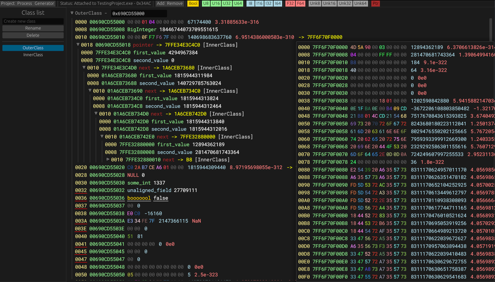

# YClass
A program that allows you to inspect and recreate data structures of other processes.


# Installation
To compile `YClass` you will need [Rust](https://www.rust-lang.org/tools/install).
```
git clone https://github.com/ItsEthra/yclass
cd yclass
cargo r --release
```

# Planned features
* [ ] - Writing values.
* [ ] - Save/Open project files.
* [ ] - Pointer preview on hover with unknown fields.
* [ ] - Disassembly of function pointers.

# Plugin API
You can write a plugin to change the way `YClass` reads memory.
To do that you will need a shared library(`.dll` or `.so`) that exports following functions
* `fn yc_attach(process_id: u32) -> u32` - Called when attaching to a process.
* `fn yc_read(address: usize, buffer: *mut u8, buffer_size: usize) -> u32` - Called when reading memory(very frequently).
* `fn yc_can_read()` - Called to check if address is "readable", i.e. a pointer.
* `fn yc_detach()` - Called when detaching from a process.
### After its done, put your library at `./plugin.ycpl` or specify the path under `plugin_path` key in your config.
Config path:
* Windows - `C:\Users\%USER%\AppData\Roaming\yclass\config.toml`
* Unix - `~/.config/yclass/config.toml`($XDG_CONFIG_HOME)
